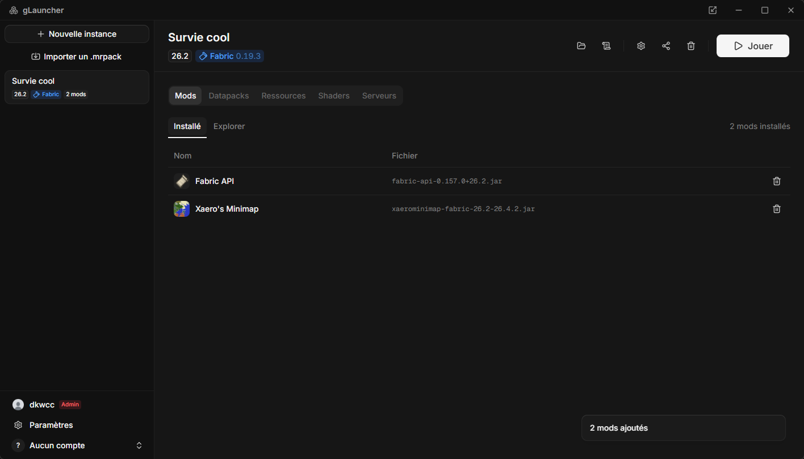

# gLauncher

[](#in-english)

Launcher Minecraft moddé pour Windows : instances isolées, installation
automatique de tout ce dont le jeu a besoin, gestion des mods via Modrinth, et
partage de modpacks au format `.mrpack`.

Écrit pour un serveur privé entre amis, sans prétention à remplacer les
launchers existants, mais complet sur ce qu'il fait.



## Ce qu'il fait

- **Instances isolées** chacune a ses mods, sa configuration et ses
  sauvegardes. Les versions, bibliothèques, ressources et JVM sont **partagées**
  entre toutes : trois modpacks en 1.20.1 ne coûtent pas trois fois le même
  téléchargement.
- **Rien à installer à la main** client, bibliothèques, natives, ressources et
  même le JDK (Temurin, téléchargé si la machine n'a pas la bonne version).
- **Fabric et NeoForge** Fabric via `meta.fabricmc.net`, NeoForge via son
  installateur officiel exécuté sans interface.
- **Mods Modrinth** recherche filtrée sur la version et le loader de
  l'instance, dépendances requises résolues et annoncées avant installation.
- **Comptes Microsoft** connexion par le flux *device code*, dans le
  navigateur système (voir plus bas).
- **Liste multijoueur** les serveurs de l'instance sont fusionnés dans
  `servers.dat` avant chaque lancement, sans écraser ceux ajoutés depuis le jeu.
- **Modpacks `.mrpack`** export d'une instance en quelques kilo-octets,
  réimport en un clic.

## Comptes

Un seul genre de compte : un compte **Microsoft**, dont le pseudo et l'UUID
viennent de Mojang. Les comptes hors-ligne sont retirés.

La connexion utilise le flux OAuth **device code** : le launcher
affiche un code, l'utilisateur le saisit dans son **navigateur système**, sur le
vrai domaine Microsoft. Aucune fenêtre de connexion embarquée, aucun mot de
passe ne transite par le launcher.

Ce qui est demandé et ce qui est gardé :

- **périmètre `XboxLive.signin offline_access` uniquement** de quoi se
  connecter à Xbox Live et Minecraft, rien d'autre ;
- les jetons vivent **dans le profil Windows de l'utilisateur**
  (`%APPDATA%\glauncher\accounts.json`) et ne sont envoyés à personne d'autre
  que Microsoft et Mojang ;
- **aucun jeton ne traverse le pont vers l'interface** : les commandes qui
  listent les comptes les effacent d'abord, ce qui est vérifié par un test.

La chaîne complète Microsoft, Xbox Live, XSTS, Minecraft vit dans
[`src-tauri/src/auth/microsoft.rs`](src-tauri/src/auth/microsoft.rs), tests
compris.

## Prérequis

- Windows 10 ou 11
- [Node.js](https://nodejs.org/) 20+ et [pnpm](https://pnpm.io/)
- [Rust](https://rustup.rs/) stable (chaîne MSVC)
- Les outils de build C++ de Visual Studio et WebView2 (installé d'office sur
  Windows 11)

## Développement

```bash
pnpm install
```

```bash
pnpm tauri dev
```

Pour travailler sans toucher à l'installation réelle dans `%APPDATA%`, poser la
variable d'environnement `GLAUNCHER_ROOT` sur un dossier jetable.

### Vérifications

```bash
cargo clippy --manifest-path src-tauri/Cargo.toml --all-targets -- -D warnings
```

```bash
cargo test --manifest-path src-tauri/Cargo.toml --lib
```

```bash
pnpm typecheck
```

Aucun test ne sort sur Internet : les échanges réseau passent par un serveur
`wiremock` local et les fixtures JSON réelles vivent dans
`src-tauri/tests/fixtures/`.

### Sans interface

Les deux exemples rejouent la logique métier depuis un terminal, ce qui est le
moyen le plus court de diagnostiquer une install qui échoue :

```bash
cargo run --manifest-path src-tauri/Cargo.toml --example launch -- 1.20.1 Pseudo --loader fabric --dry-run
```

```bash
cargo run --manifest-path src-tauri/Cargo.toml --example mods -- 1.20.1 fabric sodium journeymap
```

## Construire l'installateur

```bash
pnpm tauri build
```

L'installateur NSIS est écrit dans
`src-tauri/target/release/bundle/nsis/`. Il s'installe **pour l'utilisateur
courant**, donc sans invite d'élévation.

> L'exécutable n'est **pas signé**. Windows SmartScreen affichera un
> avertissement au premier lancement ; « Informations complémentaires » puis
> « Exécuter quand même » permet de passer. Signer demande un certificat de
> signature de code.

## Où sont les fichiers

```
%APPDATA%\glauncher\
  versions/    libraries/    assets/    java/    natives/   partagés
  instances/<id>/instance.json                             par instance
  instances/<id>/minecraft/                                gameDir du jeu
  accounts.json
  logs/                                                    journaux du launcher
```

## Limites connues

- **Windows uniquement.** Le code évite les hypothèses spécifiques à une
  plateforme là où c'est gratuit, mais rien n'est testé ailleurs.
- **Forge et Quilt ne sont pas gérés**, seulement Fabric et NeoForge.
- **Les « snap layouts » de Windows 11** (survol du bouton agrandir) ne
  fonctionnent pas : la barre de titre est dessinée par l'application, et ces
  menus demandent du code natif. Win+flèches et le glisser-vers-le-bord
  fonctionnent normalement.

## In English

gLauncher is a small, personal Minecraft launcher for Windows, written for a
private server shared between friends. It manages isolated instances, installs
everything the game needs (client, libraries, natives, assets, and a JDK when
the machine lacks a suitable one), handles the Fabric and NeoForge loaders,
installs mods from Modrinth, and imports and exports `.mrpack` modpacks.

**A genuine Microsoft account is the only way in.** There is no offline,
cracked, or made-up-username mode: the player's name and UUID come from Mojang's
profile endpoint and are never derived locally. Offline accounts existed early
on and were deliberately removed; an `accounts.json` still carrying one has it
dropped at startup.

Sign-in uses the Microsoft OAuth **device code** flow: the launcher shows a
code, the user types it in their **own system browser** on Microsoft's real
domain. No embedded login window, and no password ever passes through the
launcher. The only scope requested is `XboxLive.signin offline_access`, which
grants nothing beyond signing in to Xbox Live and Minecraft. Tokens are stored
in the user's own Windows profile and are never sent anywhere other than
Microsoft and Mojang there is no server of ours in the authentication path,
and no token is ever handed to the web view that draws the interface.

Built with Tauri 2, Rust and React. Source for the authentication chain, tests
included: [`src-tauri/src/auth/microsoft.rs`](src-tauri/src/auth/microsoft.rs).
